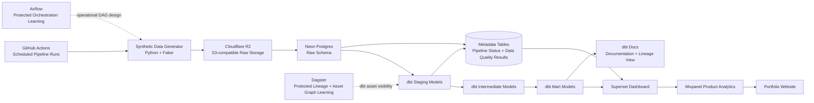
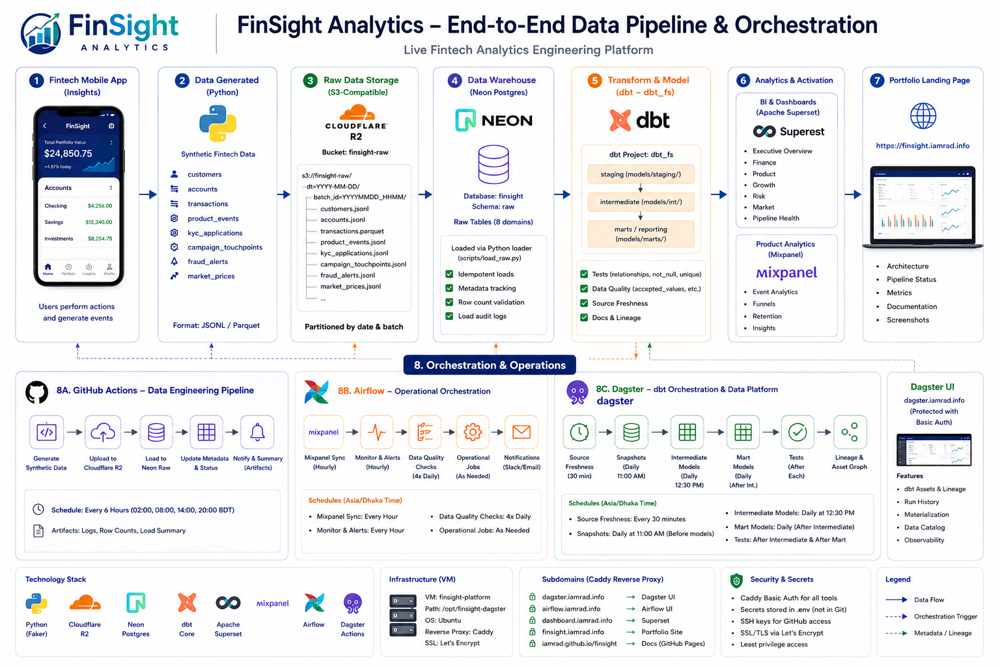
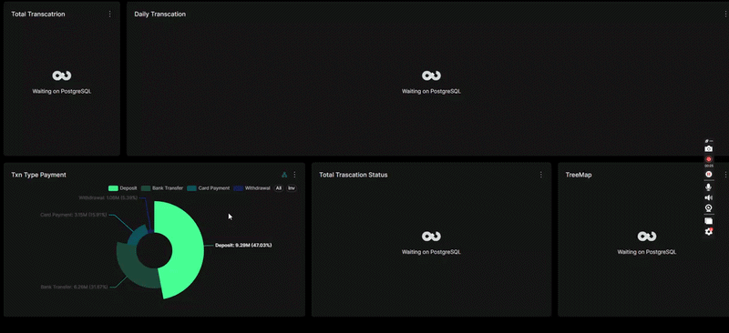
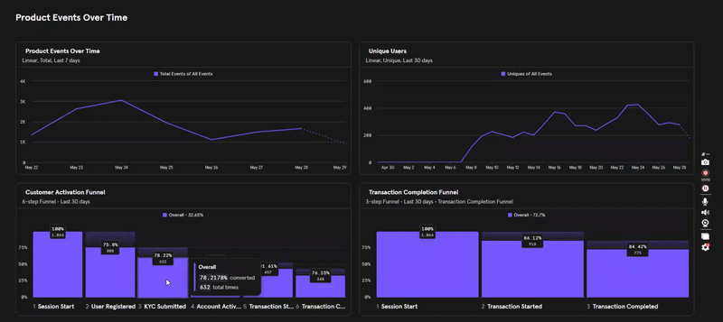
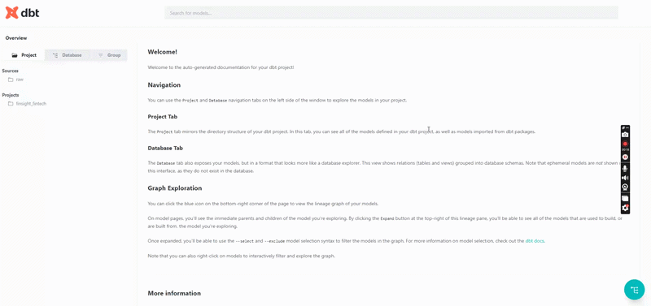
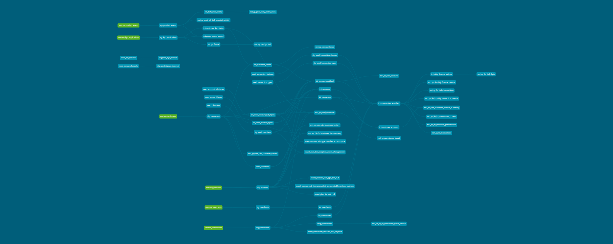
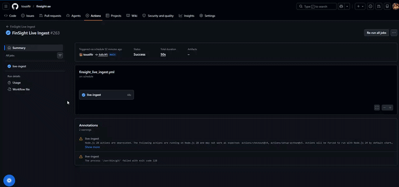
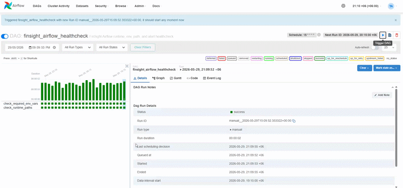
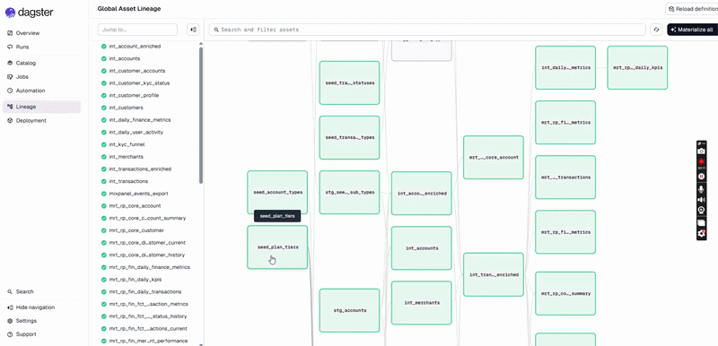

# FinSight Analytics: Live Fintech Analytics Engineering Platform

A portfolio analytics engineering platform simulating fintech transactions, onboarding, product usage, growth, risk, and pipeline health using Python, Cloudflare R2, Neon Postgres, dbt, Superset, Mixpanel, Airflow, Dagster, and GitHub Actions.

[](https://www.python.org/)
[](https://www.getdbt.com/)
[](https://neon.tech/)
[](https://superset.apache.org/)
[](https://airflow.apache.org/)
[](https://dagster.io/)
[](https://github.com/tousiftr/finsight-ae/actions)
[](https://finsight.iamrad.info/)

> **Highlighted portfolio links:** **[iamrad.info](https://iamrad.info/?utm_source=github)** · **[fintech.iamrad.info](https://fintech.iamrad.info/?utm_source=github)**

## Live Project Links

| Surface | Link |
| --- | --- |
| Project Website | [finsight.iamrad.info](https://finsight.iamrad.info/) |
| Architecture Page | [finsight.iamrad.info/architecture.html](https://finsight.iamrad.info/architecture.html) |
| dbt Docs | [dbt-finsight.iamrad.info](https://dbt-finsight.iamrad.info/#!/overview) |
| Superset Dashboard | [Open the live dashboard](https://dashboard.iamrad.info/superset/dashboard/2/?standalone=3) |
| Mixpanel Product Analytics | [Open the Mixpanel board](https://mixpanel.com/project/4027714/view/4523900/app/boards/#id=11229807) |
| Main Portfolio | **[iamrad.info](https://iamrad.info/?utm_source=github)** |
| Fintech Portfolio | **[fintech.iamrad.info](https://finsight.iamrad.info/?utm_source=github)** |
| GitHub Repository | [github.com/tousiftr/finsight-ae](https://github.com/tousiftr/finsight-ae) |

## Project Overview

FinSight Analytics is a self-built analytics engineering project that simulates a small fintech data platform. It is designed as a practical case study: synthetic source data is generated in Python, landed as raw files, loaded into Neon Postgres, transformed into reporting-ready models with dbt, and exposed through analytics surfaces that are easy to review.

The platform covers transaction activity, customer and account health, KYC onboarding, product usage, finance metrics, growth, risk, and pipeline health. dbt provides the transformation contract, reusable business models, source freshness checks, snapshots, data tests, documentation, and lineage-ready metadata. Apache Superset serves BI dashboards, while Mixpanel supports product event analysis, funnels, activation, and behavior tracking.

GitHub Actions runs scheduled automation. Airflow and Dagster add protected orchestration learning surfaces: Airflow is used for operational DAG design, retries, logs, and Mixpanel sync workflows; Dagster is used for dbt-oriented orchestration, lineage, asset graph exploration, and observability. These protected tools are described in the repository without exposing credentials or internal access details.

## Architecture Diagram



The primary data path is **generate → land → load → model → activate**. The dashed connections represent protected learning and operational surfaces rather than public endpoints.

## What This Project Demonstrates

- End-to-end analytics engineering workflow
- Synthetic fintech event and transaction generation
- Raw data landing pattern using S3-compatible storage
- Cloud warehouse loading into Neon Postgres
- dbt staging, intermediate, and mart modeling
- Data quality tests and business rule validation
- KPI dashboarding in Apache Superset
- Product analytics tracking in Mixpanel
- Scheduled automation using GitHub Actions
- Orchestration practice using Airflow
- Lineage and asset graph practice using Dagster
- Portfolio publishing through [iamrad.info](https://iamrad.info/?utm_source=github)

## Tech Stack

| Layer | Tool | Purpose |
| --- | --- | --- |
| Data generation | Python, Faker | Synthetic fintech data |
| Raw storage | Cloudflare R2 / S3-compatible storage | Raw file landing |
| Warehouse | Neon Postgres | Cloud analytical database |
| Transformation | dbt Core | Staging, intermediate, marts, tests, snapshots, and docs |
| BI | Apache Superset | Executive and operational KPI dashboards |
| Product analytics | Mixpanel | Event analytics, funnels, and behavior tracking |
| Automation | GitHub Actions | Scheduled pipeline runs and validation workflows |
| Orchestration | Airflow | DAG scheduling and operational learning |
| Lineage | Dagster | Asset graph and dbt lineage learning |
| Web | HTML/CSS, Caddy, iamrad.info | Portfolio presentation and protected service routing |

## Data Domains

The platform is organized around fintech business and operational domains:

- Customers
- Accounts
- Transactions
- KYC / onboarding
- Product events
- Campaigns
- Campaign touchpoints
- Fraud alerts
- Chargebacks
- FX rates
- Market prices
- Pipeline status
- Data quality results

The current dbt source layer focuses on customers, accounts, merchants, transactions, product events, and KYC applications. The broader list captures the business domain coverage used for portfolio planning and future model expansion.

## dbt Modeling Approach

The dbt project follows a layered modeling pattern so raw ingestion remains separate from analytics logic:

| Layer | Role |
| --- | --- |
| Raw sources | Ingestion-owned records loaded into the Neon Postgres `raw` schema |
| Staging models | Source-cleaned `stg_*` views that standardize raw payloads |
| Intermediate models | Reusable `int_*` tables for trusted business logic and enriched entities |
| Mart models | Thin reporting views using the `mrt_rp_<dept>_<model>` naming pattern |
| Data tests | Source checks, accepted values, non-null rules, freshness checks, and custom business-rule assertions |
| Documentation | dbt Docs model catalog and transformation visibility |

The dbt models are designed around clean business entities, reusable transformations, KPI reporting, and reliable downstream BI. The repository also includes seeds for controlled reference values and snapshots for customer and transaction history.

### Schema and materialization contract

- `raw` schema: ingestion-owned only
- `dbt_fs` schema: dbt-owned only
- Staging models: views
- Intermediate models: tables
- Mart/reporting models: views

## Dashboard and Analytics Surfaces

- **[Superset dashboard](https://dashboard.iamrad.info/superset/dashboard/2/?standalone=3):** presents transaction health, customer health, product activation, finance KPIs, growth, risk, and pipeline health.
- **[Mixpanel board](https://mixpanel.com/project/4027714/view/4523900/app/boards/#id=11229807):** supports event tracking, funnels, activation analysis, and product behavior exploration.
- **[dbt Docs](https://dbt-finsight.iamrad.info/#!/overview):** provides model documentation and transformation visibility.
- **[Portfolio website](https://finsight.iamrad.info/):** connects the public project surfaces for recruiters and reviewers.
- **Airflow and Dagster:** remain protected orchestration and lineage surfaces. They demonstrate operational DAG design, dbt asset visibility, retries, logs, and monitoring patterns without exposing private administration endpoints.

## Screenshot Gallery

The checked-in screenshots provide a quick visual walkthrough of the platform. Public surfaces can also be opened through the live links above. Airflow and Dagster remain protected operational surfaces, so the GIFs below provide reviewable proof without exposing administration endpoints.

### Review links

| View | Review Link | Access |
| --- | --- | --- |
| Project website | [Open website](https://finsight.iamrad.info/) | Public |
| Architecture page | [Open architecture page](https://finsight.iamrad.info/architecture.html) | Public |
| Superset dashboard | [Open Superset dashboard](https://dashboard.iamrad.info/superset/dashboard/2/?standalone=3) | Public |
| dbt Docs | [Open dbt Docs](https://dbt-finsight.iamrad.info/#!/overview) | Public |
| Mixpanel product analytics | [Open Mixpanel board](https://mixpanel.com/project/4027714/view/4523900/app/boards/#id=11229807) | Public link |
| GitHub Actions workflows | [Open Actions](https://github.com/tousiftr/finsight-ae/actions) | Public repository surface |
| Airflow DAGs | See [`airflow/dags/`](airflow/dags/) | Protected runtime surface |
| Dagster lineage | See [`dagster_project/`](dagster_project/) | Protected runtime surface |

### Data architecture



### Superset dashboard

The Superset dashboard presents the executive and operational KPI layer, including transaction health, customer health, product activation, growth, risk, and pipeline monitoring.



### Mixpanel product analytics

Mixpanel provides product event analysis, activation metrics, funnels, and behavior exploration.



### dbt Docs and lineage

The dbt documentation catalog exposes model-level metadata, while the lineage graph shows how transformations move from source data to analytics-ready models.





### GitHub Actions automation

GitHub Actions runs the scheduled pipeline workflows and repository-level automation.



### Protected orchestration surfaces

Airflow demonstrates operational DAG scheduling, retries, logs, and workflow monitoring. Dagster demonstrates dbt-oriented asset visibility, lineage, and orchestration context.





## Pipeline Schedule

The portfolio pipeline is designed around four daily reporting checkpoints in Bangladesh time (UTC+06:00):

- 02:00 AM Bangladesh time
- 08:00 AM Bangladesh time
- 02:00 PM Bangladesh time
- 08:00 PM Bangladesh time

GitHub Actions is used for scheduled automation, while Airflow is used for orchestration learning and operational DAG design. The repository also includes a higher-frequency live-ingest workflow for demonstration data and separate dbt workflows, allowing raw ingestion and model refresh tasks to run at different cadences.

## Operational Observability

- Airflow operational workflows include retry behavior, task logs, and alerting patterns for workflow health.
- Airflow includes Mixpanel sync orchestration for the product analytics activation path.
- Dagster provides dbt asset visibility, lineage, source freshness, snapshots, model runs, tests, and orchestration context.
- Mixpanel sync outcomes are tracked through metadata logging.
- Caddy fronts VM-hosted services with SSL termination and protected access controls where applicable.

## Repository Structure

```text
.
├── .github/workflows/       # Scheduled automation, dbt docs deployment, and secret scanning
├── airflow/                 # Airflow deployment assets and operational DAGs
├── dagster_project/         # Dagster definitions for dbt-oriented orchestration and lineage
├── data_generator/          # Synthetic fintech batch generation
├── dbt_fintech/             # dbt sources, staging, intermediate, marts, seeds, snapshots, and tests
├── docs/                    # Architecture notes, runbooks, definitions, and deployment handoffs
├── loaders/                 # Raw table DDL and load/verification helpers
├── object_storage/          # Cloudflare R2 upload and manifest helpers
├── product_analytics/       # Neon-to-Mixpanel sync logic
├── scripts/                 # Local and operational pipeline helpers
├── screenshots/             # Architecture, analytics, automation, and orchestration visuals
├── sql/                     # Validation and raw storage diagnostics
├── superset/                # Superset container assets
├── architecture.html        # Public architecture page
├── dashboards.html          # Public dashboard links page
└── index.html               # Public project landing page
```

## How to Read This Project

If you are reviewing this as a portfolio case study:

1. Start with the [live website](https://finsight.iamrad.info/).
2. Review the [architecture page](https://finsight.iamrad.info/architecture.html).
3. Open the [Superset dashboard](https://dashboard.iamrad.info/superset/dashboard/2/?standalone=3).
4. Open [dbt Docs](https://dbt-finsight.iamrad.info/#!/overview) to inspect the transformation layer.
5. Review the repository structure, especially [`dbt_fintech/`](dbt_fintech/), [`.github/workflows/`](.github/workflows/), [`airflow/`](airflow/), and [`dagster_project/`](dagster_project/).
6. Use the embedded screenshot gallery above to review the architecture, analytics, automation, and protected orchestration surfaces.

## Security and Access Notes

- **Public:** portfolio website, architecture page, dbt Docs, Superset dashboard, GitHub repository, and selected public analytics links.
- **Protected/private:** Airflow, Dagster, credentials, `.env` files, infrastructure secrets, database credentials, notification credentials, and administrative service access.
- Example environment and dbt profile files document configuration shape only. Secret values are not included in this README and should not be committed to the repository.

## What I Learned

- Designing an end-to-end analytics engineering platform
- Building dbt models for reusable reporting layers
- Creating dashboard-ready marts and KPI definitions
- Connecting BI and product analytics surfaces
- Documenting data lineage and pipeline behavior
- Managing public portfolio links while keeping operational tools protected

## Next Improvements

- Add a Cube semantic layer for governed metrics
- Add anomaly detection and AI-generated dashboard summaries
- Improve data quality monitoring
- Add a richer metric dictionary
- Add more lineage screenshots and pipeline status reporting
- Improve CI/CD validation around dbt builds

## Portfolio

This project is part of my analytics engineering portfolio. The live project is available at [https://finsight.iamrad.info/](https://finsight.iamrad.info/) and my main portfolio is available at [https://iamrad.info](https://iamrad.info/?utm_source=github).
